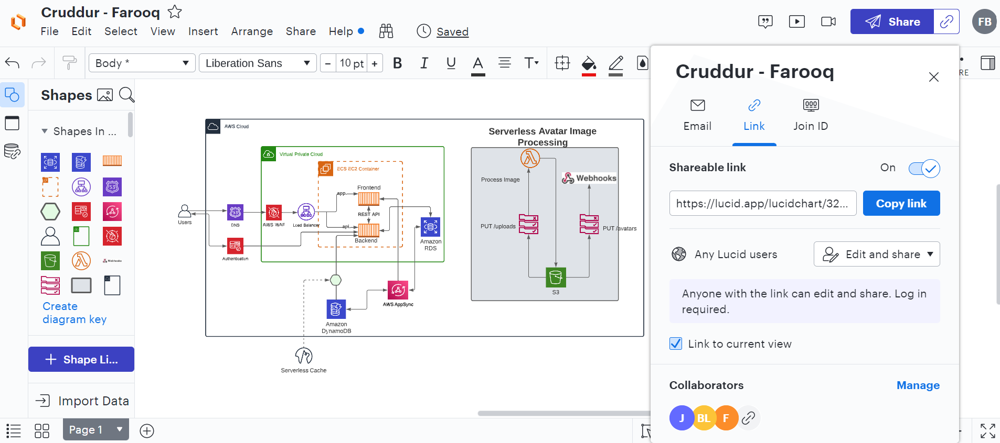
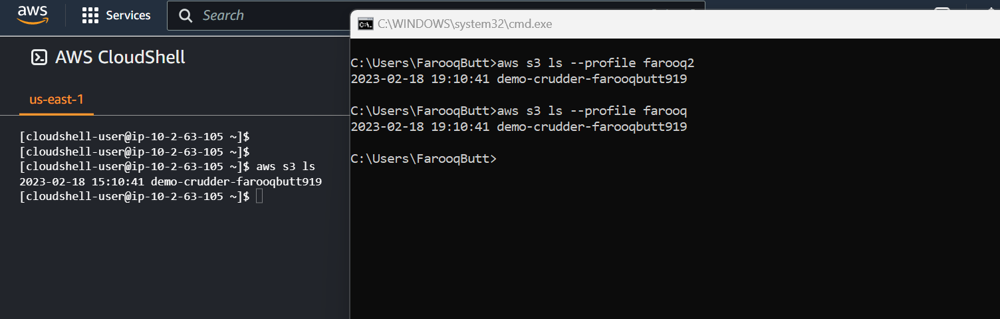

# Week 0 — Billing and Architecture

## Required Homework ##

### Lucid Chart Diagram ###


```
https://lucid.app/lucidchart/32a60b70-65bb-49ee-a181-1f36be530ea9/edit?viewport_loc=-710%2C353%2C3072%2C1293%2C0_0&invitationId=inv_dfeed5a0-adb3-48db-82de-8bb0cc67f2e4

```

### Flow Diagram ###
```
https://lucid.app/lucidchart/289f1b7d-c36a-436a-bbdf-faa40a45f3f8/edit?viewport_loc=152%2C208%2C1308%2C574%2C0_0&invitationId=inv_6b597a75-0af8-47af-a840-c9f122bbeaf8

```

### AWS CLI and Cloud Shell ###

I was able to install AWS CLI without any challenger. I also researched about how to use CLI for multiple users and came across --profile parameter. I created 2 IAM users(farooq and farooq2) and generated 2 set of credentials. I was able to switch AWS CLI credentials by using --profile parameter.

aws s3 ls --profile farooq <br>
aws s3 ls --profile farooq2


